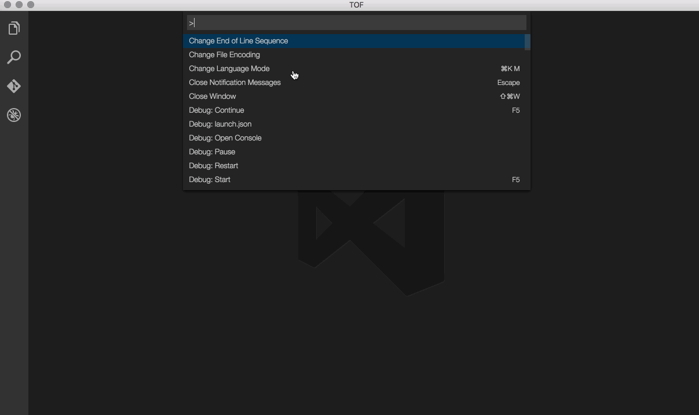
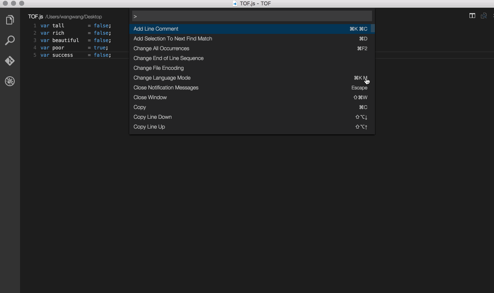

# TOF(true or false)

> True or false,that is the question.

## Install

Press `F1` and narrow down the list commands by typing `extension`. Pick `Extensions: Install Extension`.

## Usage

Press `F1` and type `TOF state change`. 

## License

MIT © [Will Wang](https://github.com/codeMonkeyWang)
